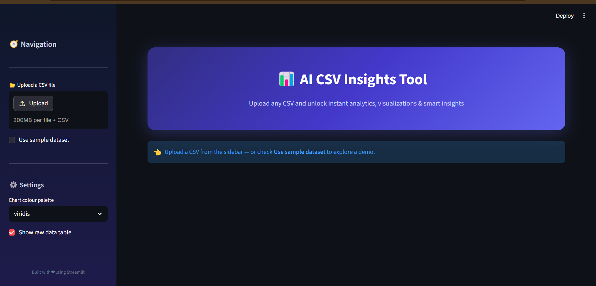
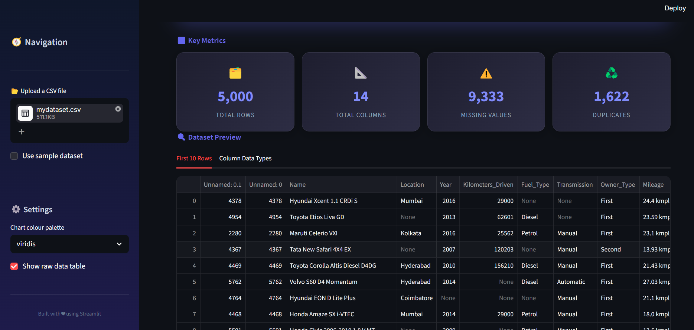
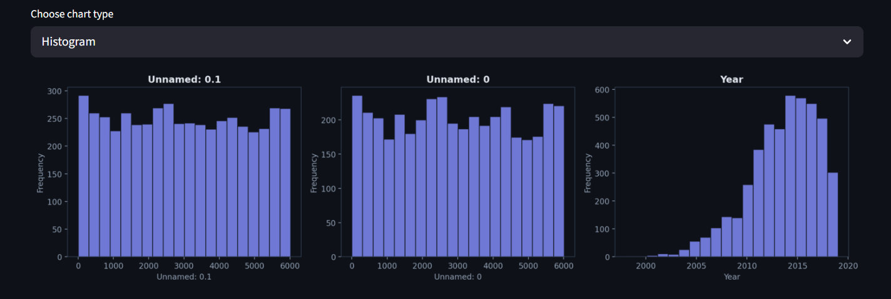

<p align="center">
  
  
  
  
</p>

<h1 align="center">📊 AI CSV Insights Tool</h1>
<p align="center"><em>Upload any CSV. Get instant analytics, smart insights & publication-ready charts — zero code required.</em></p>

---

## 🚀 Overview

**AI CSV Insights Tool** is a professional-grade, browser-based analytics dashboard built with Python and Streamlit. Upload any CSV file and the app will automatically generate:

- 📋 Dataset previews & data type summaries
- 📐 Descriptive statistics
- 🕳️ Missing value analysis with visual breakdown
- 🤖 AI-style automatic insights (trends, quality scores, key metrics)
- 📊 Interactive, multi-type chart generation
- 🔥 Correlation heatmaps
- 🧹 One-click data cleaning (drop nulls, fill means, remove duplicates)
- 💾 Downloadable & exportable cleaned datasets

---

## ✨ Features

| Feature | Description |
|---|---|
| **CSV Upload** | Drag-and-drop or browse any `.csv` file |
| **Sample Dataset** | Built-in sales dataset for instant exploration |
| **KPI Cards** | Rows, columns, missing values, duplicates at a glance |
| **Descriptive Stats** | Full `describe()` output for every numeric column |
| **Missing Value Analysis** | Per-column breakdown + horizontal bar chart |
| **AI Insights** | Auto-generated, plain-English observations about your data |
| **Data Cleaning** | Drop nulls, fill with mean, remove duplicates, reset |
| **Multi-Chart Viz** | Histogram, Bar, Line, Pie, Box Plot — user selectable |
| **Correlation Heatmap** | Seaborn-powered heatmap with annotations |
| **Column Explorer** | Deep-dive into any single column's distribution |
| **Dark Theme** | Polished dark UI with gradient cards and smooth styling |
| **Export** | Download CSV or save directly to `exports/` folder |
| **Sidebar Analytics** | File name, row/column counts, memory usage |
| **Error Handling** | Graceful handling of empty files, bad uploads, missing columns |

---

## 📸 Screenshots

> After running the app, take screenshots and place them in the `screenshots/` folder.

| Dashboard | Insights | Charts |
|---|---|---|
|  |  |  |

---

## 🛠️ Installation

### Prerequisites

- Python 3.9 or higher
- pip

### Steps

```bash
# 1. Clone the repository
git clone https://github.com/your-username/AI-CSV-Insights-Tool.git
cd AI-CSV-Insights-Tool

# 2. Create a virtual environment (recommended)
python -m venv venv
source venv/bin/activate        # macOS / Linux
venv\Scripts\activate           # Windows

# 3. Install dependencies
pip install -r requirements.txt

# 4. Run the app
streamlit run app.py
```

The dashboard will open automatically at **http://localhost:8501**.

---

## 📁 Project Structure

```
AI-CSV-Insights-Tool/
│
├── data/
│   └── sample_sales_data.csv   # Built-in demo dataset
│
├── charts/                     # Auto-saved chart images
├── exports/                    # Exported cleaned CSVs
├── screenshots/                # App screenshots for README
│
├── app.py                      # Main Streamlit application
├── requirements.txt            # Python dependencies
├── README.md                   # This file
└── .gitignore                  # Git ignore rules
```

---

## 🎯 Usage

1. **Launch** the app with `streamlit run app.py`.
2. **Upload** any CSV file using the sidebar uploader — or check *Use sample dataset*.
3. **Explore** the auto-generated KPI cards, statistics, and insights.
4. **Visualize** your data by selecting columns and chart types.
5. **Clean** the dataset with one-click buttons (drop nulls, fill means, etc.).
6. **Export** the cleaned CSV via download button or save to disk.

---

## 🧰 Tech Stack

| Technology | Purpose |
|---|---|
| **Python 3.9+** | Core programming language |
| **Streamlit** | Web dashboard framework |
| **Pandas** | Data manipulation & analysis |
| **NumPy** | Numerical computing |
| **Matplotlib** | Static chart generation |
| **Seaborn** | Statistical data visualization |

---

## 🔮 Future Improvements

- [ ] Multi-file comparison & merging
- [ ] SQL query interface on uploaded data
- [ ] GPT/LLM-powered natural language querying
- [ ] Time-series analysis & forecasting
- [ ] Excel / Parquet / JSON file support
- [ ] User authentication & saved sessions
- [ ] Automated PDF report generation
- [ ] Deployment to Streamlit Community Cloud

---

## 🌐 Deployment

### Streamlit Community Cloud (Free)

1. Push the project to a public GitHub repository.
2. Go to [share.streamlit.io](https://share.streamlit.io).
3. Connect your GitHub account and select this repo.
4. Set the main file path to `app.py`.
5. Click **Deploy** — your app will be live in seconds.

### Docker (Optional)

```dockerfile
FROM python:3.11-slim
WORKDIR /app
COPY . .
RUN pip install --no-cache-dir -r requirements.txt
EXPOSE 8501
CMD ["streamlit", "run", "app.py", "--server.port=8501", "--server.address=0.0.0.0"]
```

```bash
docker build -t csv-insights .
docker run -p 8501:8501 csv-insights
```

---

## 📄 License

This project is licensed under the **MIT License** — feel free to use, modify, and distribute.

---

<p align="center">
  <strong>⭐ Star this repo if you found it useful!</strong><br/>
  Built with ❤️ using Python & Streamlit
</p>
